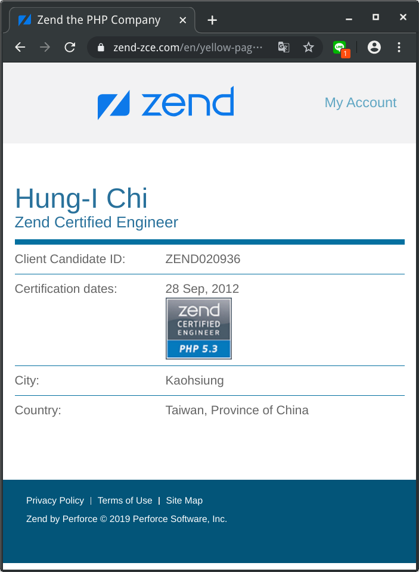
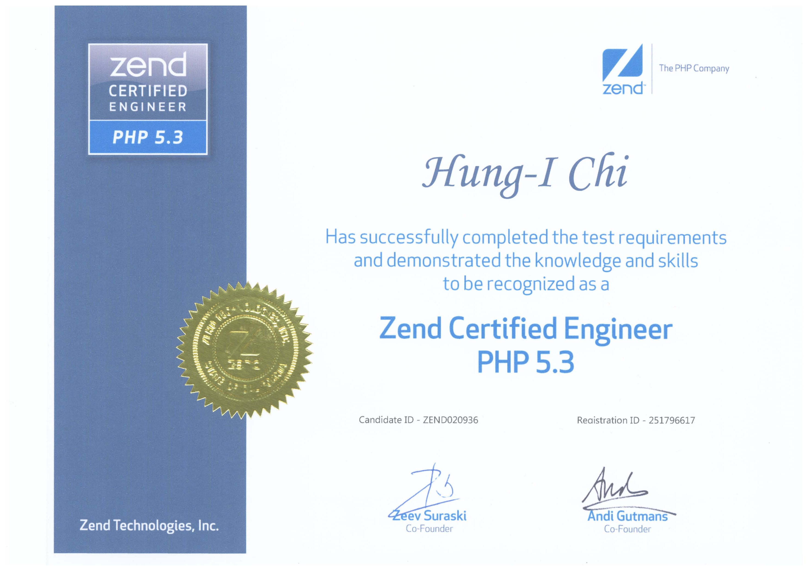
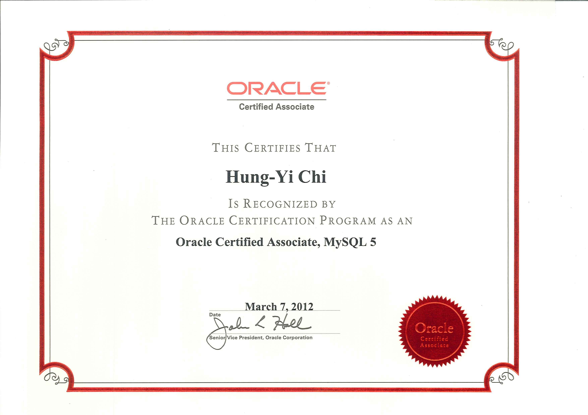

### 第零章 課前說明
#### 課程教材使用方式
+ Github 線上帳號申請
  + 練習 Git 版控
  + 放置你自己的專案
  + 放置課堂練習的程式
  + 練習佈署程式
+ 課堂下載檔案
  + 課程講義下載
    + 使用 README.md 為檔案名稱
    + 下載後，請自行上傳至 Github 站台上觀看
  + 練習程式與題目下載
    + 程式寫完後，請 git 上 Github
    + 利用 git 佈署程式至正式機上，執行程式
  + 建置環境程式下載
    + VirtualBox
    + CentOS 8 iso 檔案
    + Visual Studio Code
  
#### 專案製作
+ 專案構思與製作
  + 請開始構思網站功能
    + 請利用 Visual Studio Code 寫下這些功能名稱與作用
    + 將每個功能運作細節寫出來
    + 實作過程中，可修正不合理/無法實作的部份
    + 不要偏離目標太遠
+ 程式碼放置於 GitHub 站台
  + 利用 git 推送程式碼
  + 過程中可學習版控的方式與精神
  + 可看見自己的學習歷程
  + 完成後就是好的宣傳作品
  
#### 證照考試
+ 國內證照考試
  + [TQC MySQL](https://www.tqc.org.tw/TQCNet/CertificateDetail.aspx?CODE=hzuv6/UBs2Q=)
+ 國外證照考試
  + [Zend PHP](https://www.zend.com/training/php-certification-exam)
    + ZCE 線上查詢
  
     
    + ZCE 證照
  
     
  + [Oracle MySQL](https://education.oracle.com/mysql/mysql-database-administration/product_159)
    + MySQL 證照
  
     

#### 課程後該學會的事
+ 了解網站應用系統架構
  + 網站系統，如何運作PHP程式語言
  + MySQL 如何配合 PHP 程式語言
  + Linux 平台與 Windows 平台不同之處
  + 防火牆與網路安全的重要性 
+ 開發環境與正式環境需求
  + 要如何建立開發環境
  + 如何使用容器來做為開發環境
  + 開發環境與正式運作的環境，有什麼不同
  + 如何將開發環境調整至正式環境
  + 正式環境如何回饋問題至開發環境中
+ 版控需求與應用
  + 解決程式開發時，分工合作的問題
  + 可回復至理想的程式版本
  + 可分出不同目標的程式發行版本
  + 可了解程式開發演進歷程
+ 佈署流程的認知
  + 程式開發前中後，有不同的測試流程可進行
  + 配合測試流程，可進行程式品質管控
  + 程式設計師需了解 CI/CD 流程的目的
  + 自動化測試驗證的工作是不可少的事 