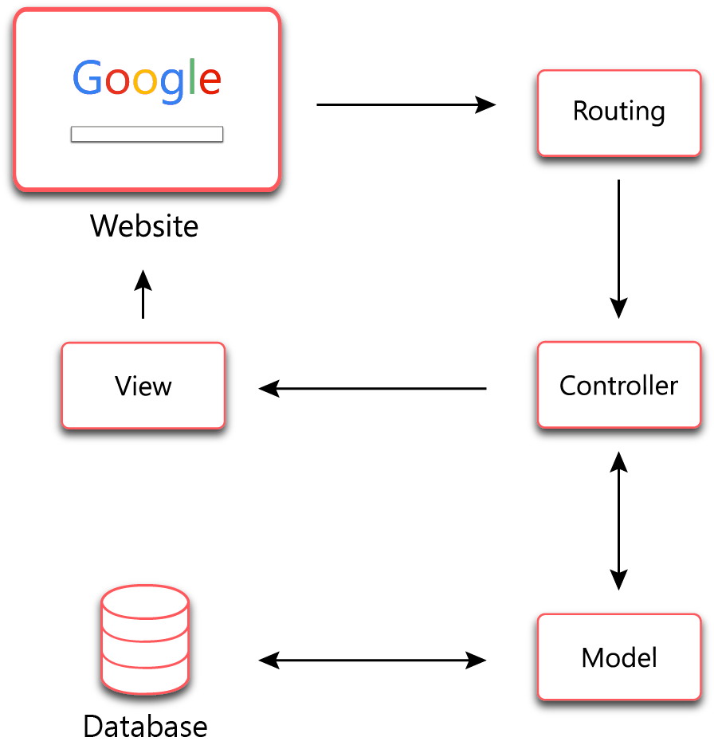
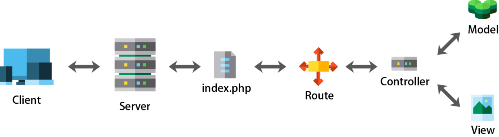

### 第十章 Laravel 的ＭＶＣ I
#### HTTP 相關基本知識
+ HTTP 資料傳遞
  + HTTP 屬無狀態協定，時常需要資料轉交至下個頁面，才能繼續進行資料處理！
  + PHP 內常用的超全域變數如下 :
    |變數名稱|說明|
    |:---|:---|
    |$_SERVER|取得伺服器及 PHP 執行環境的訊息|
    |$_GET|取得 GET 變數|
    |$_POST|取得 POST 變數|
    |$_FILES|取得文件上傳變數|
    |$_COOKIE|取得 Cookie 變數|
    |$_SESSION|取得 Session 變數|

  + GET 變數的使用
    + 利用 HTML 的 Form 表單，指定使用方法為 GET
    + 例 : form.php
      ```html
      <form action="auth.php" method="get">
      請輸入帳號密碼 : 
      帳號 : <input type="text" name="account" /><br />
      密碼 : <input type="password" name="password" /><br />
      <button type="submit">登入</button>
      </form>
      ```
    + auth.php
      ```php
      <?php
      $account = $_GET["account"];
      $password = $_GET["password"];

      echo "帳號 : ".$account;
      echo "密碼 : ".$password;
      ?>
      ```
      + 但是，瑞凡，沒人會用 GET 來傳帳密資料的！

  + POST 變數的利用
    + 將原來的表單的方法，改成 POST !
    + 例 : form.php
      ```html
      <form action="auth.php" method="post">
      請輸入帳號密碼 : 
      帳號 : <input type="text" name="account" /><br />
      密碼 : <input type="password" name="password" /><br />
      <button type="submit">登入</button>
      </form>
      ```
    + auth.php
      ```php
      <?php
      $account = $_POST["account"];
      $password = $_POST["password"];

      echo "帳號 : ".$account;
      echo "密碼 : ".$password;
      ?>
      ```

  + SESSION 變數的利用
    + 如果需要同網頁存取共同的資訊，可以使用 session !
    + session 一定啟用，短時間內不會被清除，需要自行清除資料內容！或是等待一段時間後，會被系統清除！
    + 例 : session.php
      ```php
      <?php
      //啟動 session
      session_start();
      //執行　session 存放資料功能
      $_SESSION['memID'] = "A001";
      //取得 session 資訊
      $id =  $_SESSION['memID'];
      echo "session : $id";
      //清除 session 
      unset($_SESSION['memID']);
      session_unset();
      ?>
      ```
      + session 只要換網頁，就會被清除了！

    + COOKIE 變數的應用 :
      + 想要將資料暫時存放在客戶端，可以使用 cookie !
      + 例 :
        ```php
        <?php
        //設定 cookie ，並設定有效時間
        setcookie("name","Peter",time()+3600);
        //存取 cookie
        echo $_COOKIE["name"];
        //消除 cookie
        setcookie("name","Peter",time()-3600);
        ?>
        ```

+ HTTP 標頭與回應
  + HTTP 標頭 : 用來傳送有關 HTTP 訊息的資料
    + 語法 :
      ```html
      header(String, replace, http_response_code)
      ```
      + string : 指定發送的表頭
      + replace : 是否可以取代以前的表頭，其值為 true of false
      + http_response_code : 用來強迫指定 HTTP 回應碼
    + 常見的應用方式 :
      + 例 : 利用 Location 轉址
        ```html
        header("Location: http://google.com");
        header("Location: session.php");
        ```
      + 例 : 使用 Refresh 定時更新網頁
        ```html
        header("Refresh: 5"); //每五秒更新一次網頁
        header("Refresh: 5;url=session.php");
        ```
      + 例 : 使用 Content-type 設定輸出網頁 MIME 格式編碼
        ```php
        <?php
        //指定下載的文件是 pdf 檔案格式！
        header("Content-type:application/pdf");
        //指定下載的檔案名稱為 download.pdf
        header("Content-Disposition:attachment;filename='download.pdf'");
        readfile("original.pdf");
        ?>
        ```
        + MIME 資料型態表
          |MIME 資料類型|說明|
          |:---|:---|
          |text/html|HTML網頁檔案|
          |text/xml|XML文件檔案|
          |image/jpeg|JPEG圖片檔案|
          |image/gif|GIF圖片檔案|
          |image/png|PNG圖片檔案|
          |text/plain|一般文字檔案|
          |application/pdf|PDF 文件檔|

  + HTTP 常見的回應編號
    |回應碼|回應訊息|說明|
    |:---|:---|:---|
    |200|OK|伺服器成功處理請求|
    |301|Redirect|轉換網址|
    |302|Move Permanently|網址永久轉移到新的網址|
    |304|Not Modified|文件內容未被修改，直接由瀏覽器快取讀取|
    |400|Bad Request|客戶端送了一個錯誤的請求給伺服器|
    |401|Unauthorized|客戶端未驗證身份|
    |403|Forbidden|被伺服器端拒絕請求|
    |404|Not Found|請求的網址內容不存在|
    |405|Method Not Allowed|不支援請求中的方法|
    |408|Request Timeout|請求逾時|
    |500|Internal Server Error|伺服器發生錯誤|
    |501|Not Implemented|用戶端發出的請求超出伺服器能力範圍|
    |503|Service Unavailable|目前伺服器無法提供服務|
    |505|HTTP Version Not Supported|伺服器不支援請求中的HTTP版本|

#### MVC 概念
+ MVC (Model-View-Controller)概念
  + MVC是一種軟體架構模式
  + 將系統劃分成3個部分 : Model (模型), View (視圖), Controller(控制器)，常被應用在網站的專案上
    + Model : 負責所有的商業邏輯以及資料處理，擁有對資料的直接存取權。
    + View : 負責介面呈現
    + Controller : 負責接收請求，轉發給Model處理，最後回傳結果。
  + MVC 結構圖
    

#### Laravel 的 Router 模組
+ Laravel Routing簡介
  + 有一個中間程式，它會將接收到的訊息，轉發到該去的地方
    
  + 整個網站的入口就是位於 /public/index.php
  + 預設的 Route File : /routes/web.php
    ```php
    <?php
    Route::get('/', function () {
      return view('welcome');
    });
    ?>
    ```
+ Laravel Routing 語法 :
  ```php
  Route::{HTTP verb}($url, $callback);
  ```
  + HTTP verb : 
    + GET : 取得資源
    + POST : 新增一筆資源
    + PUT : 更新一筆資源
    + Patch : 更新一筆資源的部分內容
    + Delete : 刪除一筆資源
    + Options : 取得Server支援的Request Types
      ```php
      Route::get($url, $callback);
      Route::post($url, $callback);
      Route::put($url, $callback);
      Route::patch($url, $callback);
      Route::delete($url, $callback);
      Route::options($url, $callback);
      ```
    + $url : 代表接收到的網址，像根目錄就是/，而登入可能是/login
    + $callback : 代表處理這個要求的方法
    + 其它 :
      ```php
      // 原來的 web.php
      Route::get('/', function (){
        return view('welcome');
      });
      // 可以改成
      Route::view('/', 'welcome');
      //若是比較複雜的處理，就交給 Controller 進行
      Route::get('user/profile', 'UserController@showProfile');
      ``` 
  + 接受多個 HTTP 方法 :
    ```php
    Route::match(['get','post'], '/', function(){
      // 只接受　路由 '/' 的 GET 和 POST 方法
    });

    Route::any('/',function(){
      // 可接受　路由 '/' 的所有方法
    });
    ```

+ 路由參數傳遞
  + 例 : 指定查看某一編號的網頁文章
    ```php
    Route::get('doc/{id}', 'DocController@show');
    //由 Client 端來的 id ，就會轉送到 DocController 的 show() 來進行處理，最後回傳資料給 Client 端
    ```
  + 例 : 表示可選擇的參數！
    ```php
    Route::get('users/{name?}', function ($name = 'Peter'){
      return 'Hello ,'.$name;
    });
    // {name?} 表示可填入資料，或者不填入資料！沒資料時，會填入預設的資料！
    ```
  + 例 : 多個參數資料傳遞
    ```php
    Route::get('users/{name?}/score/{project}', function ($name = 'Peter', $project){
      return 'Hello ,'.$name. ' Your project : '.$project;
    //同時多個參數傳入
    });
    ```
  + 例 : 使用正規化表達式限制參數
    ```php
    // id只能輸入 0-9
    Route::get('users/{id}', function ($id) {
      //
    })->where('id', '[0-9]+');

    // username只能輸入大小寫的英文字母
    Route::get('users/{username}', function ($username) {
      //
    })->where('username', '[A-Za-z]+');

    // id只能輸入數字;classes只能輸入特定文字
    Route::get('posts/{id}/{classes}', function ($id, $classes) {
      //
    })->where(['id' => '[0-9]+', 'classes' => '(chinese|english|math)']);
    ```

  + 例 : 路由參數規格化
    ```php
    //將參數規格統一之後，方便程式的使用與維護
    Route::pattern('member_id','abc[0-9]{10}');
    Route::get('members/{member_id}',function($member_id){
      return '會員編號:'.$member_id;
    });
    ```

+ 使用路由群組
  + 路由參數可以群組化！
    + 路由前綴 : 透過前綴詞 prefix ，群組化路由路徑！
      + 例 :
        ```php
        Route::prefix('admin')->group(function (){
          Route::get('users', function (){
            //所以網址要是/admin/users才會進來這裡
          });
        });
        ```

    + 路由中介層 : 把一群Route群組起來，經過驗證才可以進入存取
      + 例 :
        ```php
        Route::middleware(['member'])->group(function () {
          Route::get('member_center', function () {
            // 經過member middleware驗證後才能進入
          });
        });
        ``` 
      + Middleware是一個過濾機制，讓Client在存取某些資源時必須先經過驗證，否則會被導向其他地方。

+ 路由命名
  + 基本用法
    + 例 :
      ```php
      Route::get('/',function(){
        //這裡做了一堆事
      })->name('index');
      ```

  + 利用路由重新命名的方式，可以區分不同的路由作用
    + 例 :
      ```php
      // 利用 url('/login')提取資料時，容易搞混
      Route::get('post', 'PostController@index);
      Route::post('post', 'PostController@create);
      
      //重新命名之後
      Route::get('post', 'PostController@index')->name('post.index');
      Route::post('post', 'PostController@login')->name('post.login');
      //只需要使用 route('post.index') / route('post.login) 就可以各自己網址
      ```

  + 配合前綴詞的用法
    + 例 :
      ```php
      Router::group(['as'=>'users.', 'prefix'=>'users'],function(){
        Route::group(['as'=>'comments.','prefix'=>'comments'],function(){
          //路由名稱將會是 users.comments.show
          Route::get('{id}',function(){
            //要做的事
          })->name('show');
        });
      });
      ```

+ 路由表的查詢
  + 利用 artisan 提供的 route:list 指令，來查詢己經定義好的路由內容
  + 例 :
    ```bash
    # php artisan route:list
    # php artisan r:l
    ```

#### 參考文獻
[PHP Laravel 開發入門(四) – 路由(Routes)](http://www.codedata.com.tw/uncategorized/php-laravel-dev-tutorial-4-class-routes)
[Laravel Routing 路由控制](https://dometi.com.tw/blog/laravel-beginner-05/)
[Laravel Routing](https://blog.johnsonlu.org/laravel-routing/)