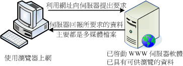

### 第六章 PHP 基本語法
#### PHP 基本觀念
+ 站台的運作方式
  + 靜態網站
    
    + 取自「鳥哥的私房菜」
  + 動態網站
    
    + 取自「鳥哥的私房菜」

+ PHP 的運作方式
  + PHP Engine
    

+ PHP 程式寫作方式
  + HTML 內嵌 PHP 程式標籤 :
    ```php
    <?php
      你的 php 程式碼;
    ?>
    ```
    + 範例 : hello.php
      ```html
      <!doctype html>
      <html lang="en">
        <head>
          <title>Hello World</title>
        </head>
        <body>
            <?php
              print "Hello World";
            ?>
        </body>
      </html>
      ```

    + 你的練習 : 請練習好下列步驟，以後章節將不會重複再說明！
      + 使用 VS Code 軟體
      + 使用 [View] -> [Extensions] -> 輸入[HTML] -> 確認是否安裝 [HTML Snippets]
      + 開新檔案，存檔成 hello.php ! 
        + 做法 [File] -> [Save As...] -> 選擇資料夾 -> 輸入檔名
      + 在 hello.php 頁籤中，實作 hello.php 內容
        + 選擇 hello.php 頁籤
        + 直接輸入 html ，在輔助視窗中，選擇 html:5
        + 在\<body\>標籤底下輸入範例內容！
        + 將檔案存檔
      + 將存好的檔案，使用 git 存好，並推上 github !
      + 進入你的正式環境內，將 github 的專案，克隆回你的主機！
        + 以 root 身份登入你的 Linux 主機
        + 切換至 /usr/share/nginx/html 目錄
          <pre><code>#cd /usr/share/nginx/html
          #git clone https://github.com/你的帳號名稱/你的專案名稱.git</code></pre>
      + 打開你的網頁，查看檔案是否有執行！
        + 請注意你的網址路徑是否正確

  + PHP 包含 HTML 標籤
    + 範例 : world.php
      ```php
      <?php
      print <<<_HTML_
          <form method="post" action="$_SERVER[PHP_SELF]">
          Your Name:<input type="text" name="user" />
          <br/>
          <button type="submit" class="btn btn-primary">Say World</button>
          </form>
      _HTML_;
      ?>
      ```
    + 範例 : world1.php
      ```php
      <?php
          print "<h5>test</h5>";
      ?>
      ```

  + PHP 基本輸出
    + 使用 echo 
    + 使用 print
    + 使用 printf() 函數
    + 例 : ex6_1.php
      ```php
      <?php
        echo "Hello <br />";
        echo 'World <br />';
        print "Hello2 <br />";
        print 'World2 <br />';
        printf("Hello World");
      ?>
      ```

  + PHP 的註解
    + 單行註解 : // or #
    + 區塊註解 : /*  */
    + 功能 :
      + 說明程式功能
      + 不執行程式
      + 其它
    + 範例 : ex6_2.php
      ```php
      <?php
        echo "你愛他 <br />";
        // echo '真的嗎？ <br />';
        print "他不愛你 <br />";
        /* 以下是猜的
        print '他有外遇 <br />';
        printf("你有外遇");
        */
      ?>
      ```

#### 變數
+ 變數 
  + 定義 : 利用一個名稱，暫時記錄某些資料。
  + 命名規則 :　$<變數名稱> 
    + 以 $ 為開頭
    + 變數名稱開頭字元為字母或底線，不能是數字！
    + 大小寫有別
  + 內容值的宣告:
    + '' or "" : 表示內容值是文字
    + 數字不需要使用 '' or ""
    + 變數若沒宣告內容值，則以預設值填入！
      + 整數、浮點數 : 0
      + 字串 : 空字串
      + 布林值 : false
      + 陣列 : 空陣列
  + 例 : ex6_3.php
    ```php
    <?php
        // 變數 a 沒宣告就使用,會產生 E_NOTICE 的警告
        echo '$a: '.$a.'<be />';
        $name = 100;
        echo '$name: '.$name.'<be />';
        $name = 'David';
        echo '$name: '.$name.'<be />';
        $a = $a + 100;
        echo '$a: '.$a.'<be />';
    ?>
    ```
+ 變數的存活範圍
  + 區域變數 : 變數的內容值只能在函數(function)內使用
  + 全域變數 : 變數的內容值可在整個程式內使用
  + 例 : ex6_4.php
    ```php
    <?php
      $x = 1;
      function hello($x){
        $sum = $x * 2;
        echo "函數執行結束 <br />";
      }
    ?>
    <p> -------我是分隔線------</p>
    <?php
      hello($x);
      echo "x=$x<br />";
      echo "sum=$sum<br />";
    ?>
    ```
+ 常數
  + 常使用，但永不改變的數值
  + 利用 define 函數定義常數名稱，方便記憶
  + 例 : ex6_5.php
    ```php
    <?php
      define('PI', 3.1415926);
      echo "圓周率：".PI;
    ?>
    ```
#### 資料型態
+ 標準資料型態
  + 整數(Integer) : 32 bits or 64 bits
    + PHP_INT_MAX : 該平台最大整數值
    + PHP_INT_SIZE : 該平台整數位元值大小
    + 運算過程中，若超出整數型態值，則自動轉成浮點數！

  + 浮點數(float) : 32 bits or 64 bits
    + 又稱實數(real)，專用於存放有小數點的數字資料型態
    + 因為 PHP 屬弱型別資料型態，所以 float or double 都是相同資料型態！
    + e : 科學表示法，表示以10為底的指數
      + 例 : 9.773e3 = 9773

  + 字串 : 沒有大小限制
    + 單引號 : 單引號中的變數不會轉成內容值
    + 雙引號 : 雙引號中的變數會轉成內容值
    + 跳脫字元 : 使用反斜線「 \ 」
      + \t : 相等於 [Tab] 鍵
      + \n : 換行，並移至行頭
      + \r : 換行

  + 布林值(boolean) :
    + 表達事件的「真」或「假」！
    + 值 : true or false / True or False / TRUE or FALSE / 其它0以外的值:true or 0:false
    + 例 : ex6_6.php
      ```php
      <?php
        $t = true;
        $f = false;
        echo "\$t 值 : $t 數字 : (int)$t "."<br />";
        echo "\$f 值 : $f 數字 : (int)$f "."<br />";
      ?>
      ```

  + 陣列(array) : 
    + 把相同的資料型態的若干個變數集合起來，就成了陣列！
    + 陣列可以是一維、二維，甚至是多維！
    + 第一筆資料，由索引值為 0 開始配置！
    + 例 : ex6_7.php
      ```php
      <?php
        $x[0] = "Hello";
        echo $x[0];
      ?>
      ```
  
  + 物件(object) :
    + 利用 class 關鍵字定義一個類別(模型)，再利用 new 關鍵字來建立這個類別的物作(實例)！

  + 資源(resource) :
    + 透過專門的函數來建立和使用，負責與外部資源的聯繫！
    + 例 : XML文件、資料庫連線、讀寫外部檔案..等等！
  
  + 空值(NULL) : 
    + 表示沒有任何內容的變數！
    + 例 : ex6_7.php
      ```php
      <?php
         $a = NULL;
         echo "\$a = $a";
      ?>
      ```

+ 資料型態轉換
  + 強制轉換
    + 轉換成整數 : (int) (integer)
    + 轉換成浮點數 : (float) (double) (real)
    + 轉換成字串 : (string)
    + 轉換成布林值 : (bool) (boolean)
    + 轉換成二進位字串 : (binary)
    + 轉換成陣列 : (array)
    + 轉換成物件 : (object)
    + 轉換成 NULL : (unset)
    + 例 : ex6_8.php
      ```php
      <?php
         $pi = 3.141592;
         echo "\$pi 轉成整數 : ".(int)$pi;
         $input = "3.141592pi";
         echo "pi 轉成浮點數 : ".(float)$input;
      ?>
      ```

  + 以函數轉換
    + settype(): 需要輸入兩個參數，一是變數，二是要轉換的資料型態！
      + 資料型態參數 : "integer"、"int"、"float"、"string"、"boolean"、"bool"、"array"、"object"、"null"
    + 轉換成功回傳 true，轉換失敗回傳 false !!
    + 例 : ex6_8.php
      ```php
      <?php
        $pi = 3.141592;
        settype($pi, "integer");
        echo "\$pi 轉成整數: ".$pi;
        $piString = "3.141592circle";
        echo "是否有轉成功".settype($piString, "float");
        echo "\$piString 是: ".$piString;
      ?>
      ```

    + 其他轉換函數 :
      + intval() : 轉換成整數
      + floatval()、doubleval(): 轉換成浮點數
      + strval() : 轉換成字串

    + gettype() : 取得資料型態
    + intdiv() : 取餘數

#### 運算子
+ 運算式與運算子
  + 例 : $a = $b + $c
    + 運算元 : $a $b $c
    + 運算子 : +

+ 運算子的優先順序
  1. 物件建立 : 複製(clone)、新增(new)
  2. 陣列 : []
  3. 轉型與遞增、遞減 : ++、--、intval()
     + 例 : 
       + ++$a : 先加再回傳
       + $a++ : 先回傳再加
  4. 邏輯運算子 : (非)「 ！」
  5. 算術運算子 : 「 * 」、「 / 」、「 % 」(取餘數)
  6. 算術運算子 : 「+」、「-」、「.」(字串運算子)
  7. 比較運算子 : 「>」、「<」、「>=」、「<=」、「==」、「!=」、「===」(型態也要相同)
  8. 邏輯運算子 : (且)「&&」、(或)「||」
  9.  條件運算子 : 「?:」(三元運算子)
  10. 指定運算子 : 「=」、「+=」、「-=」、「*=」、「/=」、「%=」、「.=」
      + 例 : $a += $b --> $a = $a + $b
      + 例 : $a = 10  
  11. 邏輯運算子 : 「and」、「or」、「xor」
      + 回傳值通常是 true 或 false !!

+ 太空船運算子
  + 符號 : 「<=>」  
  + 例 : ex6_9.php
    ```php
    <?php
       echo 1<=>1;
       echo 1<=>2;
       echo 2<=>1;
    ?>
    ```

#### 陣列
+ 宣告方式
  + 格式 : 
    + 一維 : $變數名稱["key" or index]=value;
    + 二維 : $變數名稱["key" or index]["key" or index]=value;
      + 可以視為多個一維陣列組合起來！
    + 多維 : []一直追加即可！
  + 例 : ex6_10.php
    ```php
    <?php
      //一維陣列
      $eggbox["土雞"]=30;
      $eggbox[1]=100;
      $eggbox[]=20;
      $eggbox["duck"]=50;
      $drinkbox=("啤酒"=>70,"cola"=>30);
      $foodbox=["飯團"=>50];
      echo $eggbox;
      echo $foodbox;
      echo $drinkbox;
  
      //二維陣列
      $lunch[0]["素食"]=100;
      $lunch[0]["葷食"]=150;
      $lunch["麵類"]["拉麵"]=200;
      $lunch["飯類"]["雞肉飯"]="今天不賣";
      $lunch[1]=array("廣東粥"=>80,"炸雞排"=>70);
      echo $lunch;
    ?>
    ```
    
#### 控制結構
+ 決策控制
  + if ... else
    ```php
    if (條件式){
      條件式為真時，執行本程式區塊
    } else {
      條件事為假時，執行本程式區塊
    }
    ```
    + 例 : ex6_11.php
      ```php
      <?php
         $i = 10;
         if ( $i > 10 ){
           echo "Hello World";
         } else {
           echo "Good Bye";
         }
         if ($i == 10) echo "Too Many";
         else $i+=100;
         echo $i; 
      ?>
      ```

  + 三元運算子(1) : 「 ?: 」
    ```php
    (條件式) ? 條件為真執行這行 : 條件為假執行這行 ;
    ```
    + 例 : ex6_11.php
      ```php
      //$i 延用上一個範例
      echo ($i > 101)?"大":"小";
      ```

  + 三元運算子(2) : 「 ?? 」
    + 例 : ex6_11.php
      ```php
      $input = isset($value)? $value : "空的";
      //Null Coalesce Operator
      $input = $value ?? "空的";
      echo $input;
      ```

  + if ... elseif ... else
    ```php
    if (條件式1) {
      條件式 1 成真時，執行此程式區塊;
    } elseif (條件式2) {
      條件式 2 成真時，執行此程式區塊;
    } else {
      以上條件式均為假時，執行此程式區塊;
    }
    ```
    + 例 : ex6_11.php
      ```php
      //$i 延用上上一個範例
      if ( $i >= 200 ){
        echo "\$i 大於 200";
      } elseif ( $i >= 100 ){
        echo "\$i 大於100，小於200";
      } else {
        echo "\$i 小於 100";
      }
      ```
    
  + switch 語法 : 一種判斷可得多種不同結果
    ```php
    switch(條件變數或表達式){
      case "A":
        當結果為 A 時，執行本區塊程式;
        break;
      case "B":
        當結果為 B 時，執行本區塊程式;
        break;
      default:
        沒有符合的結果，執行本區程式;
    }
    ```
    + 例 : ex6_11.php
      ```php
      <?php
        $fruit = "Apple";
        switch($fruit){
          case "apple":
            echo "這是 apple";
            break;
          case "banana":
            echo "這是 banana";
            break;
          default:
            echo "打錯字了嗎";
        }
      ?>
      ```

  + 作業: 寫一支可以判斷成績等級的程式

+ 迴圈控制
  + for 迴圈 :
    + 用於可數的重複工作
    + 語法 :
      ```php
        for (起始值;條件式;步進值){
          需要重複做的事;
        }
      ``` 
    + 例 : ex6_12.php
      ```php
      <?php
        // 從 1 加到 50 的整數和
        // 以下方式只是為了說明 for 迴圈的使用方式，不是好的程式碼寫法！！
        $sum = 0;
        for ($i = 1; $i <= 50; i++){
            $sum += $i;
        }  
        echo "總合是: $sum";
      ?>
      ```

  + while 迴圈 :
    + 用於有條件限制的重複工作
    + 先判斷條件，成立後再執行工作！
    + 語法 : 
      ```php
        while ( 條件式 ){
          需要重複做的事;
        }
      ```
    + 例 : ex6_12.php
      ```php
        $sum = 0;
        while ( $i <= 50 ){
          $sum += $i;
          $i++;
        }
      ```

  + do ... while 迴圈 :
    + 用於有條件限制的重複工作
    + 先工作，再進條件判斷，決定需不需要繼續執行！
    + 語法 :
      ```php
        do {
          需要重複做的事;
        } while (條件式);
      ```
    + 例 :
      ```php
      $sum = 0;
      $i = 1;
      do {
        $sum += $i;
        $i++;
      } while ($i <= 50);
      ```

  + 無窮迴圈 :
    + 永不停止的重複執行
    + 建議放入一個可中斷程式的判斷程式
    + 語法 :
      ```php
        for (;;){ }
        while(true){ }
        do { } while (true); 
      ```
    + 例 : ex6_12.php
      ```php 
        $sum = 0;
        $i = 0;
        while (true){
          $i++;
          $sum += $i;
          if ( $sum >= 100) break;
        }
        echo "\$sum : $sum";
      ```

+ 巢狀迴圈
  + 迴圈內有迴圈，即為巢狀迴圈！
  + 沒事請少用巢狀迴圈
  + 語法 :
    ```php
      //以下僅表示雙層巢狀迴圈，可以再多幾層迴圈
      for(起始值;條件式;步進值){
        for(起始值;條件式;步進值){
          需要重複做的事;
        }
      }

      while(條件式){
        while(條件式){
          需要重複做的事;
        }
      }

      do {
        do {
          需要重複做的事;
        } while (條件式);
      }while (條件式);
    ```
  + 例 : ex6_13.php
    ```php
    <?php
    //九九乘法表
    for ($i = 2; $i < 10; $i++){
      for ($j = 1; $j < 10; $j++){
        printf("%d*%d=%d \t",$i,$j,($i * $j));
      }
      printf("\n");
    } 
    ?>
    ```

+ break 與 continue
  + break 用法 : 跳出迴圈、switch 時使用！
    + 語法 :
      ```php
        break;   //跳出目前的迴圈
        break 1; //跳出目前的一層迴圈
        break 2; //跳出目前的二層迴圈
      ```
    + 例 : ex6_14.php
      ```php
      <?php
        while (true){
          echo "這是第一層迴圈！<br />";
          while (true){
            echo "這是第二層迴圈！<br />";
            break 2;
          }
        }
        echo "己跳出二層迴圈！";
      ?>
      ```

  + continue 用法 : 于迴圈中，略過這一次，執行下一次的工作！
    + 例 : ex6_15.php
      ```php
        <?php
          while($i <= 10){
            if ( $i == 5) {
              echo "略過 \$i = $i <br />";
              continue;
            }
            echo $i."<br />";
          }
        ?>
      ```

#### 參考文獻
+ [鳥哥的私房菜](http://dic.vbird.tw/linux_server/unit10.php)
+ [PHP 官網](https://www.php.net/)