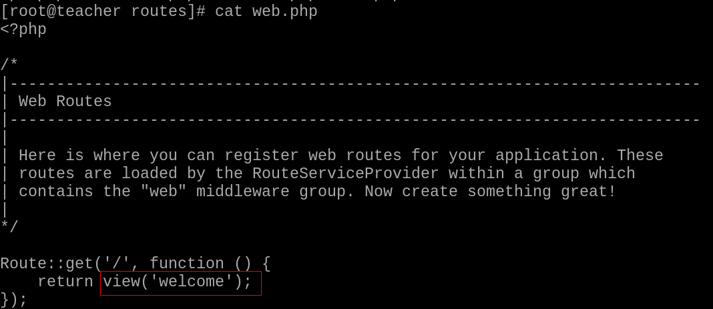
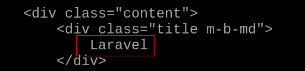

### 第九章 套件、框架、Composer
#### 套件
+ PHP 套件庫
  + 提供開發者相關套件，可加快開發速度！
  + Packagist 網站
    + 網站站址 : https://packagist.org/
    + 利用 Composer 工具，可以取得該站台上的套件！

+ 自製套件
  + 可自行開發套件，再上傳至 packagist ，提供給所有人使用
    + 過程請查看參考文獻
#### Composer
+ Composer 工具
  + 功能與作用 :
    + Composer 是 PHP 套件中，相依性的命令列管理工具
    + 協助解析套件所需要的對應套件！
    + Laravel 框架在管理各個 PHP 套件相依性的主要工具
  + 安裝方式 :
    +  Windows 使用者，請查看參考文獻
    +  Windows 平台上沒有 PHP 套件，請記得下載安裝！
    +  PHP 下載站台，請查看參考文獻！
    +  Linux 使用者，可以查看第８章內容！

+ Composer 運作方式 :
  + 相關運作的檔案
    + composer.json : json 格式的檔案，是 Composer 的設定檔，主要提供開發人員察看維護。內容包含項目如下 :
      + 專案說明
      + 依頼套件及版本號
      + 其它設置
      + 自訂 script 及 event hook
      + 此檔案會進版本控制
    + composer.lock : json 格式的檔案，提供軟體程式使用的，會自動維護，不需要人為修改
      + 記錄安裝時詳細的版本號，確保多人協作或線上環境都使用同一份套件及程式碼
      + 此檔案會進版本控制
    + vendor 目錄
      + 用於存放下載依頼套件及 autoload 相關檔案
      + 此資料夾可不用進版本控制
  + 相關指令的使用
    + 查詢指令用法
      ```bash
      # composer help [可接指令名稱]
      ```
    + 更新 Composer
      ```bash
      # composer self-update
      ```
    + 查詢 Packagist 站台內的套件
      ```bash
      # composer search laravel 
      ```
    + 互動式建立 composer.json
      ```bash
      # composer init [options]
      # cd 專案目錄
      # composer init
      ```
      + name
      + description
      + type
      + require
      + require-dev
      + authors
      + minimum-stability
      + license
    + 安裝依賴套件
      ```bash
      # composer require [options] [--] [<packages>]... [版本號]
      # composer require monolog/monolog
      ``` 
      + 版本號的用法:
        + 直接指定版號，例如2.7.3
        + 指定主版號之後，使用"*"指定次版號，例如2.7.*表示版號大於等於2.7.0，小於2.8.0的版本
        + 使用>、>=、!=、<=、<等在版號前，表示使用這些比較運算子來指定版號規則，可以使用多個規則並用","分開
        + 使用"~"在版號前，表示下一個版號變動之前的版本。例如~2.7，表示版本大於等於2.7，小於3.0
        + 在版號之後，還可以加上不同的stability flag，例如2.7.*@beta。可以使用的flag有：dev、alpha、beta、RC、stable
    + 安裝套件
      ```bash
      # composer install [options] [--] [<packages>]...
      # composer install 
      ```
      + 依據 composer.lock 安裝對應版本套件，通常用於第一次建立本地環境或線上環境。
      + 若本地無 composer.lock 檔，會同時建立一份。
      + 在正式環境中，不需要安裝 require-dev 的套件時，可加上 --no-dev 來加速安裝時間及減少空間使用
    + 更新套件
      ```bash
      # composer update [options] [--] [<packages>]...
      # composer update
      ```
      + 依據 composer.json 版本號條件，更新條件下最新版套件，會同時更新 composer.lock 檔案
    + 重新產生 autoload 檔案
      ```bash
      # composer dump-autoload [options]
      # composer dump-autoload
      ```
      + 重新產生 autoload 檔案，由於 Composer 會快取依頼的檔案，當修改路徑或載入，最好執行一遍重新建立快取檔。

#### 框架
+ 框架思維
  + 用來規範開發流程以及撰寫程式原則
    + 提高開發速度
    + 提昇程式執行效率
    + 降低協同作業的難度
    + 增加程式的安全性
  + 有名的框架 : Zend、CakePHP、CodeIgniter、Laravel

+ Laravel 框架特色
  + 現代化 : 以 Symfony 框架為核心，結合外部套件所形成！利用 Composer 來管理套件的相依性！
  + 路由 : Laravel 提供一個整合的路由介面，方便開發者使用！
  + 模型化的資料庫建立及操作 : 利用物件關聯映射(Object Relation Mapping)概念，實作 ActiveRecord ，建立對資料庫系統的支援！
  + 樣板引擎 : 使用 Blade 實現 MVC 功能
  + 設定與部署 : 使用 .env 檔案與 config 目錄來提供開發者對於整個網站應用程式的設定，對於將來上線站台時，也可以使用自動化工具，自動部署站台
  + 其他功能

+ 安裝與設定 Laravel
  + 建立專案
    + 使用 Composer 來建立專案
      + 在 PHP 練習的目錄(PHPexerise)下，建立一個 PHPproject 專案目錄
        ```bash
        $ composer create-project --prefer-dist laravel/laravel PHPproject
        ```
    + 編寫 .gitignore
      ```bash
      # nano .gitignore
      PHPproject/vendor
      ```
    + 推送至 github 站台上
      ```bash
      $ git add .
      $ git commit -m "Add Laravel"
      $ git push -u origin master
      ```
  + 到正式環境站台設定
    + 到網頁目錄內，取得練習的專案
      ```bash
      # cd /usr/share/nginx/html
      # git pull origin master
      ```
    + 安裝需要的套件
      ```php
      # yum install php-xml rsyslog
      # systemctl start rsyslog
      # systemctl restart php-fpm
      ```
    + 使用 Composer，將套件裝齊(Composer 安裝法，請參考前面章節)
      ```bash
      # cd PHPexerise/PHPproject
      # composer install
      ```
    + 注意一下目錄權限設定
      ```bash
      # chown -R nginx ../PHPproject
      # semanage fcontext -a -t httpd_sys_rw_content_t "/usr/share/nginx/html/PHPexerise/PHPproject/storage(/.*)?"
      # semanage fcontext -a -t httpd_sys_rw_content_t "/usr/share/nginx/html/PHPexerise/PHPproject/resources(/.*)?"
      # restorecon -Rvv ../PHPproject
      ```
    + 設定 .env 檔案
      ```php
      # cd ../PHPproject
      # cp .env.example .env
      ```
    + 設定加密的 key
      ```php
      # # php artisan key:generate
      ```
  + 在用戶端或是你開發的平台上，打開瀏覽器，查看結果
    + 網址 : http://正式環境站台IP/PHPexerise/PHPproject/public/

+ Laravel 目錄結構
  + app : 專案核心目錄，程式邏輯全放置在這目錄下！
    + app 依 PSR-4 規定，名稱空間為 App，依功能區分以下目錄
      |檔案|功能說明|
      |:---|:---|
      |Console|放置自有定義 Artisan 指令與相關的命令列檔案
      |Events|預設不存在！在執行 Artisan 指令 event:generate 或 event:make 時生成！專門放直事件相關的類別檔！|
      |Exceptions|處理例外狀況的處理類別|
      |Http|主要有 Controllers、Middleware、Requests 及 ViewComposers目錄，放置 Http 請求流程中所執行的內容|
      |Jobs|預設不存在！在執行 Artisan 指令 make:job 時才會產生！放置工作排程用，可處理較長時間的任務！|
      |Listeners|預設不存在！在執行 Artisan 指令 event:generate 或 make:listener 時才會產生！放置時件的偵聽類別！|
      |Mail|預設不存在！在執行 Artisan 指令 make:mail 時才會產生！放置與郵件類別相關的檔案！|
      |Notifications|預設不存在！在執行 Artisan 指令 make:notification 時才會產生！包含應用程式中所有的通知類別！|
      |Policies|預設不存在！在執行 Artisan 指令 make:policy 時才會產生！放置與身份驗證相關的檔案類別！|
      |Providers|由 config 裡的 app.php ，將服務提供者檔案放置於此|
      |Rlues|預設不存在！在執行 Artisan 指令 make:rule 時才會產生！目錄內包含自定義表單規則，及其相關類別|
  + bootstrap : 框架的啟動目錄，內含 cache ，加快存取！
  + config : 放置框架設定檔案
  + database : 放置資料庫的資料表結構及基礎資料的目錄
  + public : 專案的根目錄，放置靜態檔案！index.php 是整個應用程式的進入點
  + resources : 含 views、lang、js、scss目錄！
  + routes : 專案內的所有路由專案
  + storage : 含 app、framework、logs 目錄！
  + tests : 含 PHPUnit 的測試範例
  + vendor : 由 Composer 建立，放置套件用！
  + 其他重要檔案 :
    + .env : Laravel 環境設定檔，可由範例檔 .env.example 複製
    + artisan : artisan 主要程式進入點！只能在專案目錄內執行
    + composer.jaon : 描述所使用的 php 套件資訊及版本
    + composer.lock : 描述所下載的 php 套件資訊及版本

+ Artisan 工具
  + Artisan 是 Laravel 內建的命令列工具
  + 使用該指令工具，可加速開發專案的速度
  + 語法 :
    ```bash
    php astisan 指令 選項 參數
    ```
    + 選項 :
      + --help,-h : 查詢指令與說明
      + --version,-v : 查詢框架的版本 
  + 常用指令 :
    + list : 列出所有可用的指令
    + key:generate : 建立專案用 hash 加密金鑰！如果 .env 檔案中未設定，則需要使用該指令重新產生！
    + tinker : 提供一個簡易的交互命令列，方便測試！
    + route:[子命令] : 路由相關指令
    + maker:[子命令] : 用於快速建立專案相關的檔案
    + migrate:[子命令] : 用於快速建立資料表及資料內容
    + db:seed : 在完成 migrate 指令後，該指令可將 seeds 目錄中的基礎資料裝入資料庫中
    + vendor:publish : 將第三方元件的內容複製到所設定的目錄，方便設定及修改！

+ Laravel 運作流程
  1. 依伺服器運作環境設定，導入 public/index.php
  2. 載入 PHP 類別映射檔
  3. 啟動框架及服務提供者
  4. 讀取中介層檔案(如果沒有設定中介層，會直接跳過)
  5. 導入PHP路由(Route)
  6. 導入 MVC (Module View Controller)結構
  7. 回傳結果給客戶端 
  + 例 : route/web.php
　　
    + view('welcome') =>表示是 resources/view/welcome.blade.php 檔案！
  + welcome.blade.php :
    
    + 修改一下紅色框的部份，再重新整理網頁！

#### 參考文獻
+ [開發工具 ： 用Composer管理相依性](https://ithelp.ithome.com.tw/articles/10136653)
+ [Composer安裝教學](https://ithelp.ithome.com.tw/articles/10190770)
+ [PHP 下載站台](https://windows.php.net/download/#php-7.2-ts-VC15-x64)
+ [Windows 安裝 PHP 7.2](https://blog.csdn.net/Jeffid/article/details/83452528)
+ [Composer 依頼管理工具介紹](https://xnote.dev/composer-introduction.html)
+ [撰寫你的package](https://medium.com/back-ends/laravel-5-%E6%92%B0%E5%AF%AB%E4%BD%A0%E7%9A%84package-458c93c279bc)